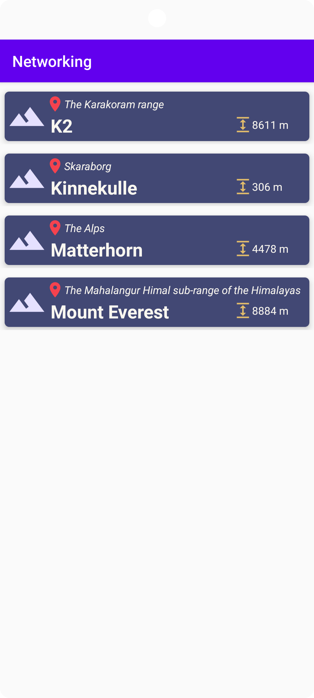
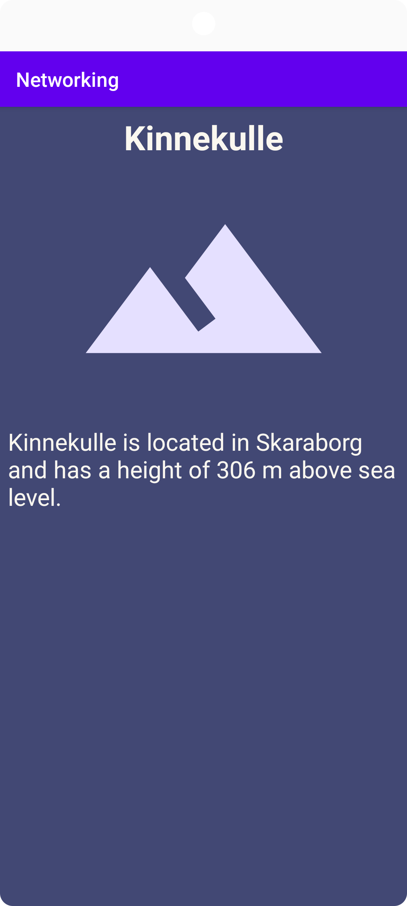

# Rapport

**Project to fetch and use data from JSON.**

For this assignment, JSON data is provided as a local file as well as via a URL.
The goal is to deserialize the JSON data and display the information in a recycler view.

Looking at the JSON data, it appears that a JSONarray was provided containing a couple of JSONobjects.
From this, a class Mountain is created with the same properties that are in the JSONobjects,
with an exception of the field "size" in the JSONobject that is deserialized but is changed to "height" in the Mountian class.

Only some data is of interest and wil be used, therefor only some properties are chosen to be deserialized, these are:
- name
- location
- size ("height")

To deserialize JSON data, it is first converted to a string. Then, GSON is used to do the actual deserialization of JSON.
As the contents is that of a JSONarray which is to be deserialized into a list of objects, this needs to happen in two steps, first by using Type and TypeToken.

TypeToken is used to specify to GSON what object to convert the JSON to.
What is desired is specifically _an array of objects of the class Mountain_ but it is not possible to just type in ArrayList<Mountain>,
therefor this middle-step is needed to specify it as an arraylist of mountain objects.

See code blow:

```
private ArrayList<Mountain> mountains;
...

@Override
    public void onPostExecute(String json) {
    Gson gson = new Gson();

    Type mountainListType = new TypeToken<ArrayList<Mountain>>(){}.getType();
    mountains = gson.fromJson(json, mountainListType);   
    ...
```
As the goal is to display objects in a recycler view, a recycler view is added to the layout activity_main
then another layout file is created to design the look of one (1) item.
Text views are placed to later fill with the name, location and height of a Mountain object.
Vectors with different icons is added to drawable folder.
These are later also added to the layout file for a recycler view item to further hint at what type of information is being displayed or communicated.

Results are shown below:


A custom RecyclerView adapter class is created to avoid a "messy" MainActivity class and to easier read and handle the code.
The class extends _RecyclerView.Adapter<MyRecyclerViewAdapter.MyViewHolder>_,
where MyRecyclerViewAdapter is the custom class created and MyViewHolder is a custom ViewHolder created along with the adapter class to bind data to items,
that is, to specifically assign variables to the views from the recycler_view_item layout file and use them in the java code.
The custom class is then added to MainActivity.java as a member along with an ArrayList<Mountain> called mountains.

The following code is then used to display information of the objects in the mountains array list.
```
RecyclerView recyclerView = findViewById(R.id.recyclerView);

adapter = new MyRecyclerViewAdapter(this, mountains, this);

recyclerView.setAdapter(adapter);
recyclerView.setLayoutManager(new LinearLayoutManager(this));
```
The results are shown below:


An interface is created to make sure that any class that implements the interface has the methods that is listed in the interface.
MainActivity implements the interface and its method onItemClick with an int parameter. The parameter is for knowing which item in the recycler view is being clicked.

In the custom adapter class, a variable is defined to hold the interface and it is also added to the constructor as a parameter.
Then, an onClickListener is attached the item view in the constructor of the inner class.
The interface is also passed in to the class to make sure it is not null,
and then the position is taken from the adapter class because it is needed for the onItemClick method.

See code below:
```
@Override
public void onClick(View v) {
    if(iRecyclerView != null) {
        int pos = getAbsoluteAdapterPosition();

        if (pos != RecyclerView.NO_POSITION) {
            iRecyclerView.onItemClick(pos);
        }
    }
}
```
The onItemClick method is then defined to start a new activity when an item in the recycler view is clicked,
and the information in the specific item that was clicked is passed on to the second activity that is starting and being displayed there.

See code below: (code in MainActivity)
```
@Override
    public void onItemClick(int position) {
        Intent intent = new Intent(MainActivity.this, SecondActivity.class);

        intent.putExtra("keyName", mountains.get(position).getName());
        intent.putExtra("keyInfo", mountains.get(position).info());

        startActivity(intent);
    }
```
And the result:


Code in SecondActivity:
```
String name = getIntent().getStringExtra("keyName");
String info = getIntent().getStringExtra("key

TextView tvName = findViewById(R.id.sa_tv_name);
TextView tvInfo = findViewById(R.id.sa_tv

tvName.setText(name);
tvInfo.setText(info);
```
When a user presses anywhere on the second activity, it stops with the method finish() and the user is taken back to MainActivity and the list of mountains.
